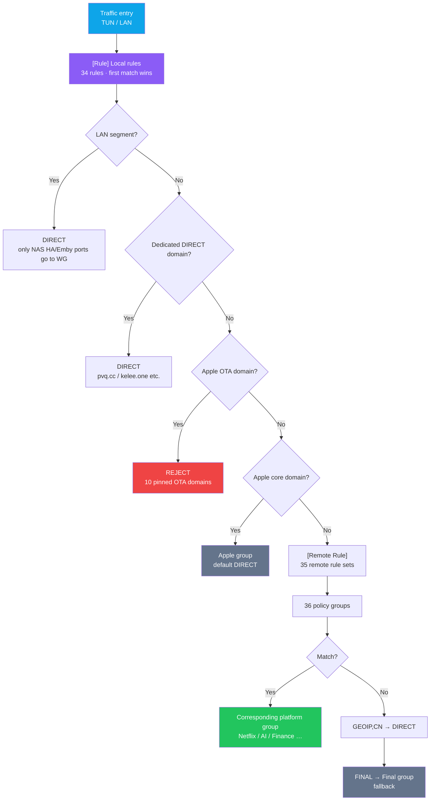
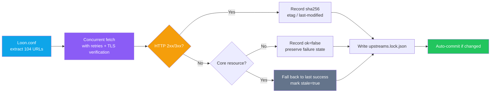

<p align="center"><a href="./README.md">简体中文</a> | <b>English</b></p>

<div align="center">

<picture>
  <source media="(prefers-color-scheme: dark)" srcset="./docs/images/logo-white.png" />
  
</picture>

# Loon Config

**A personal Loon traffic routing config. 36 policy groups, 104 upstream resources, automated daily health checks.**

Traffic routing isn't just dumping every node into one group — ads must be blocked before MITM kicks in, Apple must be matched before ad-blocking rules, AI traffic must avoid the HK region, and when an upstream goes down you should be able to tell exactly which one broke.

[Loon.conf](./Loon.conf) &nbsp;·&nbsp; [Traffic Routing Design](#traffic-routing-design) &nbsp;·&nbsp; [Daily Upstream Health Check](#daily-upstream-health-check) &nbsp;·&nbsp; [Engineering Notes](#engineering-notes-pitfalls-we-hit)

[](https://apps.apple.com/app/loon/id1373567447)
[](#traffic-routing-design)
[](#daily-upstream-health-check)
[](#daily-upstream-health-check)
[](#dont-commit-real-credentials)
[](#disclaimer)

</div>

---

## Preview

There's no UI — the deliverable is the routing behavior on the phone, plus a daily upstream health check ledger. Below is the actual record from **2026-09-30**:

```
$ python3 scripts/refresh_upstreams.py
扫描 Loon.conf -> 提取 104 个上游资源
  [200]  74 条可达
  [403]  30 条不可达   ← 全部来自 kelee.one

generated_at   : 2026-09-30T06:42:40Z
resource_count : 104
合计校验       : 15.8 MB / 104 个 sha256
```

The last 6 upstream health checks (triggered on a daily schedule, all successful):

| Date | 09-30 | 09-29 | 09-28 | 09-27 | 09-26 | 09-25 |
|---|---|---|---|---|---|---|
| Result | ✅ | ✅ | ✅ | ✅ | ✅ | ✅ |

> The ledger is **measured**, not a placeholder. In the 09-30 run above, all 30 of the 403s point at `kelee.one` —
> that's not the upstream being down; it's the collection machine's egress IP being challenged by Cloudflare.
> This later became the #1 pitfall in the [Engineering Notes](#engineering-notes-pitfalls-we-hit), and it directly
> motivated the `kelee.one` DIRECT rule in the config.

---

## What Problem Does This Actually Solve

It turns "which traffic takes which line" from something done by gut feeling into something with rules, ordering, fallbacks, and health checks.

The hard part was never stacking up nodes — it's **ordering and boundaries**:

- Ad-blocking rules are `REJECT`, while Apple service domains are mixed into generic suffixes like `icloud.com` — whoever matches first wins. Get the rule order wrong and you get "Apple sometimes won't open."
- AI services are sensitive to the egress region; HK lines are hit-or-miss, and if they get mixed into a `url-test` group they'll be picked as the fastest.
- There are 104 upstream resources across 6 sources. Some day `raw.githubusercontent.com` acts up and you can't tell whether it's down or it's your own network.
- The config also contains **real credentials** (private keys, proxy passwords), and the repo is public.

So the effort distribution of this config is **70% ordering and boundaries, 30% nodes**.

---

## Traffic Routing Design



### Rule Order: Four Gates

The part of the config that took the most thought isn't the policy groups — it's the **arrangement** of those 34 lines in the `[Rule]` section. Local rules match before remote rules, so the gate order decides everything:

| Order | Gate | Why it must sit at this position |
|---|---|---|
| ① | LAN segment `DIRECT` | Reaching the NAS at home shouldn't detour through a proxy. But ports 8123 / 8097 on the NAS are exceptions — `AND` logic rules pick them out individually into the WG tunnel |
| ② | Dedicated DIRECT domains | Resource sites like `iris.pvq.cc` / `kelee.one` are only stable on DIRECT (see Engineering Notes) |
| ③ | Apple OTA `REJECT` | Must come **before** the Apple whitelist, otherwise the whitelist pulls OTA domains back into the Apple group |
| ④ | Apple core whitelist | Must come **before** the remote ad-blocking `REJECT`, otherwise AdRules kills `icloud.com` / `me.com` by mistake |
| ⑤ | `GEOIP,CN` → `FINAL` | Fallback |

> The relative order of ③ and ④ is the only pair that must never be swapped: the OTA domain `swcdn.apple.com` also matches the `apple.com` suffix —
> whitelist first and the blocking never works; REJECT first and the whitelist can't rescue it.
> This was settled only after we'd been bitten by "Apple sometimes won't open."

### How the 36 Policy Groups Are Layered

Groups aren't split crudely by country — they're grouped **by the shared egress needs of a class of services**:

| Layer | Groups | Design intent |
|---|---|---|
| Base | `Available` `Proxy` `Final` | `Available` auto url-tests, `Proxy` is the master proxy, `Final` is the fallback |
| Platform | `Google` `Apple` `Microsoft` | `Apple` defaults to `DIRECT` (DIRECT is the most reliable for Apple services in China); switch manually when you need out-of-region services |
| Streaming | `Netflix` `Disney` `HBO` `Spotify` `YouTube` `Bilibili` | `Bilibili` defaults to `DIRECT` |
| Social | `Instagram` `Telegram` `LinkedIn` | —— |
| Finance | `Finance` | Covers Alipay, UnionPay and 8 domestic banks; defaults to `DIRECT` |
| Short video | `TikTok` `Douyin` | `Douyin` defaults to `DIRECT` |
| Region | `HK` `TW` `SG` `JP` `KR` `US` `AU` `EU` `AS` `AM` `AF` `CF` | `AS` uses negative lookaheads to exclude already-listed Asian nodes, `AM` excludes the US |
| AI | `AI` `OpenAI` `Gemini` `Claude` | **None of them contain HK nodes** |
| Other | `Emby` `HomeNAS` `Speedtest` | `Emby` defaults to proxy, with 4 addresses forced to DIRECT |

### Why the AI Groups Exclude Hong Kong

The `AI` group is a `url-test` whose filter uses negative lookaheads:

```ini
AI_NoHK_Filter = NameRegex, FilterKey = "(?i)^(?!.*(港|香港|HK|Hong)).*(美国|...|日本|...|新加坡|...)"
```

It's not that HK is slow — it's that **some AI services' region whitelists simply don't include Hong Kong**. Health checks
(`generate_204`) only measure connectivity and latency; they can't detect region-based risk control: the lowest-latency HK node
gets picked as the best, and then the server replies "region not supported." The `OpenAI` / `Gemini` / `Claude` groups default to `AI`,
and you can also pin them to a specific region manually.

> This is the most counterintuitive lesson in the project: **reachable ≠ usable**. A speed-test group cannot solve risk control.

---

## Daily Upstream Health Check

104 upstream resources across 6 sources, checked once a day by GitHub Actions running `refresh_upstreams.py`
(321 lines / 14 functions).



### Core Resources Fall Back to the Last Successful Record

`CORE_MARKERS` pins down 5 categories of resources that must never break (blackmatrix7 rules, Qure icons, fmz200 scripts,
Moli-X GeoIP, Sub-Store parsers). If a fetch of one of them fails, the script **doesn't write `ok=false`;
instead it falls back to the last successful value and flags `stale: true`** — avoiding false alarms in the daily job
from transient network jitter, and avoiding drowning a genuinely dead upstream in noise.

Latest health check (2026-09-30), measured:

| Metric | Value |
|---|---|
| Total resources | 104 |
| Reachable | 74 |
| Unreachable | 30 (all `kelee.one`) |
| **Core resources** | **67 / 67 reachable** |
| Total bytes verified | 15.8 MB |

Breakdown by source:

| Source | Count | Notes |
|---|---|---|
| `Koolson/Qure` | 35 | Policy group icons |
| `blackmatrix7/ios_rule_script` | 31 | Remote traffic routing rules |
| `Kelee plugin` | 30 | Plugins and scripts (all red this run, see below) |
| `fmz200/wool_scripts` | 4 | Plugins and extra icons |
| `sub-store-org/Sub-Store` | 1 | Subscription parser |
| Others | 3 | GeoIP / ASN etc. |

> Core resources are 67/67 all green. All 30 red entries are on `kelee.one` — the collection machine is
> overseas and its egress is challenged by Cloudflare. **This does not mean the plugins are down**; at the
> same moment, DIRECT from inside China returned all 200s.

---

## Don't Commit Real Credentials

The repo is public, and the config naturally contains three classes of sensitive values: WireGuard private keys, proxy passwords, and subscription URLs.

The approach is to replace every real value with a placeholder — `<client-private-key>`, `username`, `password` —
**plus a CI scan** (`.github/workflows/secret-scan.yml`) that blocks the push on any hit:

| Check | Match target |
|---|---|
| Private key | `private-key = "<base64 ≥ 40 chars>"` |
| Empty password | Non-empty `secret` / `password` / `passwd` fields (placeholders excluded) |
| Proxy credentials | `http, <ip>, <port>, <user>, <pass>` form |

> Relying on "remember not to commit" isn't enough — placeholders get bypassed by some temporary
> "let me just test it locally first" edit. So the scan lives in CI, triggered on both `push` and `pull_request`.

---

## Files

| File | Lines | Purpose |
|---|---|---|
| `Loon.conf` | 285 | Main config. 36 policy groups, 34 local rules, 35 remote rules, 28 plugins |
| `Loon-minimal.conf` | 32 | **Minimal troubleshooting config**: base routing only, no plugins / scripts / rewrites / remote rules / MITM |
| `Stash.yaml` | 143 | Stash policy config converted from the Loon config |
| `clash-advanced.yaml` | 433 | Advanced Clash config, with policy group anchors and subscription placeholders |
| `scripts/refresh_upstreams.py` | 321 | Upstream resource health check script |
| `IconSet/Color/` | 6 | Policy group icons and `icons-all.json` |
| `.upstream/upstreams.lock.json` | —— | Ledger of ETag / Last-Modified / sha256 for all 104 resources |

### What the Minimal Config Is For

When troubleshooting "some service won't load," the worst approach is **toggling rules one by one in the 285-line main config**.
`Loon-minimal.conf` cuts the variables down to just 5 rules + 2 groups, so you can A/B against it:

- Works on the minimal config ⇒ some component in the main config is at fault; re-add items one by one to locate it
- Still broken on the minimal config ⇒ unrelated to rules; the problem is in Loon itself / TUN / network state

This bisection cuts the troubleshooting space in half in one shot.

---

## Quick Start

```bash
# 1. Clone
git clone https://github.com/abobb414/loon-config.git
cd loon-config

# 2. Fill in your own credentials (the repo contains placeholders; don't commit real values back)
#      [Proxy]        Home-OpenClash's address / port / username / password
#      [Proxy]        Home-NAS-WG's private key / public key / endpoint
#      [Remote Proxy] your own subscription URL
$EDITOR Loon.conf

# 3. Run an upstream health check locally (optional)
python3 scripts/refresh_upstreams.py

# 4. Import into Loon
#    Config -> New config -> paste the raw URL of Loon.conf -> switch to it
```

---

## Engineering Notes: Pitfalls We Hit

The config is 285 lines, but a good chunk of them went into places that **look unimportant yet turn out to be critical**.

<table>
<tr><th width="34%">Symptom</th><th width="66%">Root cause & fix</th></tr>
<tr>
<td><b>China ad-blocking plugins failing en masse</b></td>
<td>The root cause was <b>not the plugin sources being down</b> — it was <b>double egress</b>: <code>kelee.one</code> wasn't judged as DIRECT on either the Loon side or the gateway side,
so it went to the on-prem proxy core first, which then sent it abroad, and the egress IP got a
<code>cf-mitigated: challenge</code> CAPTCHA from Cloudflare. Loon fetches plugins via <code>CFNetwork/URLSession</code>,
<b>doesn't run JS, and can never pass</b>.<br/>
The tell is the response headers <code>cf-mitigated: challenge</code> + <code>Just a moment...</code> —
when you see this signature you shouldn't say "the site is down"; you should ask "why was this egress singled out".<br/>
The fix is adding <code>DOMAIN-SUFFIX,kelee.one,DIRECT</code> on <b>both sides at once</b>.</td>
</tr>
<tr>
<td><b>Misled by 403s, nearly reached a completely wrong conclusion</b></td>
<td>The first investigation sampled from a single egress, got all 403s → wrote down "upstreams are block site-wide." <b>Switch egresses, and at the very same moment everything is 200.</b><br/>
Lesson: <b>a 403 verdict must be cross-checked from multiple egresses</b>. Fixed URL + fixed UA, log the egress IP at the same time,
and build a two-way "egress IP × status code" table. Single-point sampling will give you a completely wrong conclusion.<br/>
Measured at the time: egress SG-Amazon all 403 ×6, egress JP-GSL all 200 ×6, 6/6 stably reproducible.</td>
</tr>
<tr>
<td><b>Apple "sometimes unreachable"</b></td>
<td>The remote <code>AppleFirmware.list</code> doesn't live up to its name: all 174 entries are normal service domains like <code>icloud.com</code> /
<code>itunes.com</code> / <code>me.com</code>, <b>not a single OTA domain</b>,
yet it was paired with <code>REJECT</code> — effectively mass-killing Apple services.<br/>
Fixed by removing that remote rule set, pinning 10 real OTA domains locally (<code>swcdn</code> / <code>swscan</code> /
<code>mesu</code> …), and placing them <b>before</b> the Apple whitelist.</td>
</tr>
<tr>
<td><b>AdGuard blocking stopped working at home</b></td>
<td>The original config sent the entire <code>192.168.1.0/24</code> segment through the WG tunnel, so DNS queries from AdGuard and smartdns on the gateway got sucked into the tunnel and then dropped by the whitelist.<br/>
Fixed by picking <b>only the NAS's HA / Emby ports</b> into the tunnel via <code>AND</code> logic rules, with the rest of the LAN all on DIRECT.</td>
</tr>
<tr>
<td><b>Policy groups flapping for no reason</b></td>
<td><code>test-timeout</code> set to 1s was too aggressive; weak-network nodes were all falsely marked as failed and
the <code>url-test</code> groups kept jumping. Stable after relaxing it to 3s.</td>
</tr>
<tr>
<td><b>Degraded WeChat video / FaceTime call quality</b></td>
<td>Earlier, <code>disable-stun = true</code> was enabled to save data, which broke STUN hole-punching and forced calls through relays —
exactly contradicting the intent of <code>allow-udp-proxy</code>. Now disabled.</td>
</tr>
<tr>
<td><b>WeChat message send/receive black hole</b></td>
<td>A wildcard like <code>*.qq.com</code> in <code>[Host]</code> matched and pointed at an unreachable upstream,
black-holing every service under that domain.<br/>
How it was located: <code>Loon-minimal.conf</code> bisection — if it's still broken on the minimal config, it's rule-unrelated.
WeChat core domains are now pinned to DNSPod as a safety net.</td>
</tr>
</table>

---

## Limitations

- **No node subscriptions included**: the public version only has placeholders; bring your own subscriptions and credentials.
- **Region policies are empirical**: `AS` / `AM` / `EU` use negative lookaheads to exclude already-listed regions; any change in node naming may let some slip through.
- **The health check collector is overseas**: the 30 `kelee.one` 403s are an artifact of the collection environment, not proof the resources are unusable —
  `ok=false` entries in the ledger must be read together with the egress region.
- **AI region whitelists change**: excluding HK from the `AI` group is the current conclusion; once server-side policies shift, it needs re-mapping.

---

## Acknowledgements

- [blackmatrix7/ios_rule_script](https://github.com/blackmatrix7/ios_rule_script): Loon remote traffic routing rules
- [Cats-Team/AdRules](https://github.com/Cats-Team/AdRules): ad-blocking rules
- [Koolson/Qure](https://github.com/Koolson/Qure): policy group icons
- [fmz200/wool_scripts](https://github.com/fmz200/wool_scripts): plugins, ad rules and extra icons
- [Moli-X/Tool](https://github.com/Moli-X/Tool): config structure reference, GeoIP / ASN resources
- [sub-store-org/Sub-Store](https://github.com/sub-store-org/Sub-Store): subscription parser and subscription management ecosystem
- Kelee Loon plugins: source of the plugin modules used in the config
- [Loon](https://apps.apple.com/app/loon/id1373567447): the client and the runtime environment for this config

---

## Disclaimer

This repo is for personal config backup and study only. Adjust it to your own subscriptions, nodes, region needs, and network environment before use.

> **Don't commit real credentials.** This repo is public; private keys, proxy passwords, and subscription URLs in the config must all be placeholders.
> Real values live only in local configs. CI is set up to scan before push — anything resembling a credential blocks the push outright.

Deferring to your actual network environment; this config comes with no warranty of any kind.
