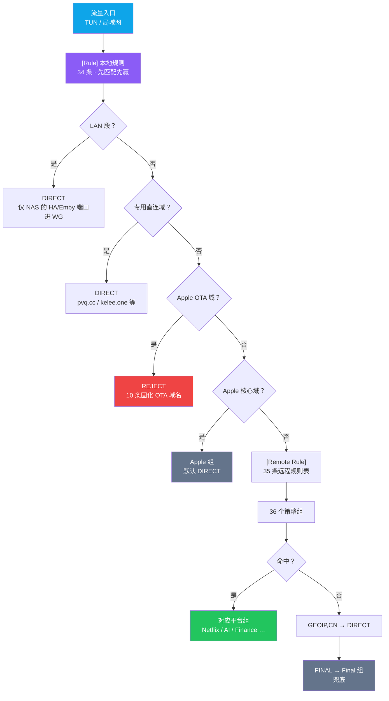
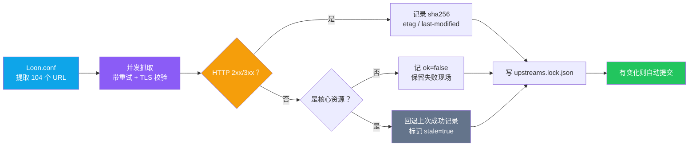

<p align="center"><b>简体中文</b> | <a href="./README.en.md">English</a></p>

<div align="center">

# Loon Config

**一份自用的 Loon 分流配置。36 个策略组、104 个上游资源、每天自动体检。**

分流不是把节点全堆进一个组就完事 —— 广告要拦在 MITM 之前、苹果要抢在去广告规则之前、
AI 要避开港区、上游挂了要能看出来是哪一条挂的。

[Loon.conf](./Loon.conf) &nbsp;·&nbsp; [分流设计](#分流设计) &nbsp;·&nbsp; [上游体检](#上游体检每天一次) &nbsp;·&nbsp; [工程笔记](#工程笔记那些踩过的坑)

[](https://apps.apple.com/app/loon/id1373567447)
[](#分流设计)
[](#上游体检每天一次)
[](#上游体检每天一次)
[](#不要提交真实凭据)
[](#说明)

</div>

---

## 预览

没有界面 —— 产物就是手机上的分流行为，和每天一份的上游体检台账。以下是 **2026-09-30** 的实际记录：

```
$ python3 scripts/refresh_upstreams.py
扫描 Loon.conf -> 提取 104 个上游资源
  [200]  74 条可达
  [403]  30 条不可达   ← 全部来自 kelee.one

generated_at   : 2026-09-30T06:42:40Z
resource_count : 104
合计校验       : 15.8 MB / 104 个 sha256
```

近 6 次上游体检（每天定时触发，全部成功）：

| 日期 | 09-30 | 09-29 | 09-28 | 09-27 | 09-26 | 09-25 |
|---|---|---|---|---|---|---|
| 结果 | ✅ | ✅ | ✅ | ✅ | ✅ | ✅ |

> 台账是**实测**，不是占位符。上表 09-30 那次 30 条 403 全部指向 `kelee.one` ——
> 那不是上游挂了，是采集机的出口 IP 被 Cloudflare 挑战了。这件事后来成了
> [工程笔记](#工程笔记那些踩过的坑)里的头号坑，也直接催生了配置里那条 `kelee.one` 直连规则。

---

## 它到底在解决什么

把「哪些流量走哪条线」这件事，从「凭感觉切」变成「有规则、有顺序、有兜底、有体检」。

难点从来不在堆节点，而在**顺序和边界**：

- 去广告规则是 `REJECT`，苹果服务域混在 `icloud.com` 这种通用后缀里 —— 谁先匹配谁说了算，
  规则顺序错了就是「苹果偶尔打不开」。
- AI 服务对出口地区敏感，港区线路时好时坏，混进 `url-test` 里会被测速选成最优。
- 上游资源有 104 个，跨 6 个来源。某天 `raw.githubusercontent.com` 抽风，
  你不知道是它挂了还是自己网络的问题。
- 配置里还有一堆**真实凭据**（私钥、代理口令），而仓库是公开的。

所以这份配置的工作量分布是 **七成在顺序与边界、三成在节点**。

---

## 分流设计



### 规则顺序：四道闸门

配置里最花心思的不是策略组，是 `[Rule]` 段那 34 条的**排列**。本地规则先于远程规则匹配，
所以闸门顺序决定一切：

| 顺位 | 闸门 | 为什么必须在这个位置 |
|---|---|---|
| ① | LAN 段 `DIRECT` | 在家访问 NAS 不该绕代理。但 NAS 的 8123 / 8097 两个端口例外 —— 用 `AND` 逻辑规则单独挑出来进 WG 隧道 |
| ② | 专用直连域 | `iris.pvq.cc` / `kelee.one` 这类资源站，直连才稳（见工程笔记） |
| ③ | Apple OTA `REJECT` | 必须**早于** Apple 白名单，否则白名单会把 OTA 域捞回 Apple 组 |
| ④ | Apple 核心白名单 | 必须**早于**远程去广告 `REJECT`，否则 AdRules 误杀 `icloud.com` / `me.com` |
| ⑤ | `GEOIP,CN` → `FINAL` | 兜底 |

> ③ 和 ④ 的相对顺序是唯一不能颠倒的一对：OTA 域 `swcdn.apple.com` 也匹配 `apple.com` 后缀 ——
> 先放白名单，屏蔽就失效；先放 REJECT，白名单救不回来。
> 这是踩过「苹果偶尔打不开」之后才定下来的。

### 36 个策略组的分层

不是按国家粗暴分组，而是**按「同一类服务对出口的共同诉求」分组**：

| 层级 | 组 | 设计取向 |
|---|---|---|
| 基础 | `Available` `Proxy` `Final` | `Available` 自动测速，`Proxy` 是总代理，`Final` 兜底 |
| 平台 | `Google` `Apple` `Microsoft` | `Apple` 默认 `DIRECT`（国内苹果服务直连最稳），需要外区服务时手动切 |
| 流媒体 | `Netflix` `Disney` `HBO` `Spotify` `YouTube` `Bilibili` | `Bilibili` 默认 `DIRECT` |
| 社交 | `Instagram` `Telegram` `LinkedIn` | —— |
| 金融 | `Finance` | 覆盖支付宝、云闪付与 8 家国内银行，默认 `DIRECT` |
| 短视频 | `TikTok` `Douyin` | `Douyin` 默认 `DIRECT` |
| 区域 | `HK` `TW` `SG` `JP` `KR` `US` `AU` `EU` `AS` `AM` `AF` `CF` | `AS` 用负向断言排除已列出的亚洲节点，`AM` 排除美国 |
| AI | `AI` `OpenAI` `Gemini` `Claude` | **全部不含香港节点** |
| 其他 | `Emby` `HomeNAS` `Speedtest` | `Emby` 默认走代理，4 个地址强制直连 |

### AI 组为什么排除香港

`AI` 组是 `url-test`，过滤器带负向断言：

```ini
AI_NoHK_Filter = NameRegex, FilterKey = "(?i)^(?!.*(港|香港|HK|Hong)).*(美国|...|日本|...|新加坡|...)"
```

不是嫌香港慢 —— 是**部分 AI 服务对出口地区的白名单不含香港**。健康检查
（`generate_204`）只测连通性和延迟，测不出地区风控：延迟最低的香港节点会被选成最优，
然后服务端返回「地区不支持」。`OpenAI` / `Gemini` / `Claude` 三个组默认指向 `AI`，
也可手动钉死具体地区。

> 这是本项目里最反直觉的一条：**能连通 ≠ 能用**。测速组解决不了风控问题。

---

## 上游体检（每天一次）

104 个上游资源跨 6 个来源，靠 GitHub Actions 每天跑一次 `refresh_upstreams.py`
（321 行 / 14 个函数）。



### 核心资源保留上次成功记录

`CORE_MARKERS` 圈定 5 类不能断的资源（blackmatrix7 规则、Qure 图标、fmz200 脚本、
Moli-X GeoIP、Sub-Store 解析器）。它们若某次抓取失败，**不写 `ok=false`，
而是回退上次成功值并打 `stale: true`** —— 避免偶发网络抖动让每日任务产生假警报，
也避免把「上游真的挂了」淹没在噪声里。

最新一次体检（2026-09-30）实测：

| 指标 | 值 |
|---|---|
| 资源总数 | 104 |
| 可达 | 74 |
| 不可达 | 30（全部为 `kelee.one`） |
| **核心资源** | **67 / 67 可达** |
| 合计校验字节 | 15.8 MB |

按来源分布：

| 来源 | 条数 | 说明 |
|---|---|---|
| `Koolson/Qure` | 35 | 策略组图标 |
| `blackmatrix7/ios_rule_script` | 31 | 远程分流规则 |
| `Kelee plugin` | 30 | 插件与脚本（本次全红，见下） |
| `fmz200/wool_scripts` | 4 | 插件与补充图标 |
| `sub-store-org/Sub-Store` | 1 | 订阅解析器 |
| 其他 | 3 | GeoIP / ASN 等 |

> 核心资源 67/67 全绿。30 条红的全在 `kelee.one` —— 采集机在境外，
> 出口被 Cloudflare 挑战。**这不代表插件挂了**，同一时刻从国内直连是全 200 的。

---

## 不要提交真实凭据

仓库是公开的，而配置文件天然含三类敏感值：WireGuard 私钥、代理认证口令、订阅地址。

做法是把真实值全部换成占位符 —— `<client-private-key>`、`username`、`password` ——
**再加一道 CI 扫描**（`.github/workflows/secret-scan.yml`），命中即拦截：

| 检查项 | 匹配目标 |
|---|---|
| 私钥 | `private-key = "<base64 ≥ 40 字符>"` |
| 空口令 | 非空的 `secret` / `password` / `passwd` 字段（占位符除外） |
| 代理凭据 | `http, <ip>, <port>, <user>, <pass>` 形式 |

> 只靠「记得别提交」是不够的 —— 占位符容易被某次「先本地测一下」的临时代码绕过。
> 所以扫描放在 CI 上，`push` 与 `pull_request` 双触发。

---

## 文件说明

| 文件 | 行数 | 用途 |
|---|---|---|
| `Loon.conf` | 285 | 主配置。36 个策略组、34 条本地规则、35 条远程规则、28 个插件 |
| `Loon-minimal.conf` | 32 | **最小化排查配置**：只有基础分流，无插件 / 脚本 / 改写 / 远程规则 / MITM |
| `Stash.yaml` | 143 | 由 Loon 配置转换而来的 Stash 策略配置 |
| `clash-advanced.yaml` | 433 | Clash 进阶配置，含策略组锚点与订阅占位 |
| `scripts/refresh_upstreams.py` | 321 | 上游资源体检脚本 |
| `IconSet/Color/` | 6 | 策略组图标与 `icons-all.json` |
| `.upstream/upstreams.lock.json` | —— | 104 条资源的 ETag / Last-Modified / sha256 台账 |

### 最小化配置是干什么的

排查「某个服务访问不了」时，最怕的是**在 285 行的主配置里逐条注释试验**。
`Loon-minimal.conf` 把变量砍到只剩 5 条规则 + 2 个组，用它做 A/B：

- 最小化配置下正常 ⇒ 主配置的某个组件有问题，逐项加回定位
- 最小化配置下仍异常 ⇒ 与规则无关，问题在 Loon 本身 / TUN / 网络状态

这道二分能把排查范围一次砍掉一大半。

---

## 快速开始

```bash
# 1. 克隆
git clone https://github.com/abobb414/loon-config.git
cd loon-config

# 2. 填上自己的凭据（仓库里是占位符，勿把真实值提交回去）
#      [Proxy]        Home-OpenClash 的地址 / 端口 / 用户名 / 口令
#      [Proxy]        Home-NAS-WG 的私钥 / 公钥 / 端点
#      [Remote Proxy] 自己的订阅地址
$EDITOR Loon.conf

# 3. 本地跑一次上游体检（可选）
python3 scripts/refresh_upstreams.py

# 4. 在 Loon 里导入
#    配置 -> 新建配置 -> 填 Loon.conf 的 raw 地址 -> 切换过去
```

---

## 工程笔记：那些踩过的坑

配置 285 行，但不少行数花在了**看起来不重要、实际会要命的地方**。

<table>
<tr><th width="34%">症状</th><th width="66%">根因与解法</th></tr>
<tr>
<td><b>国内去广告插件集体失效</b></td>
<td>根因<b>不是插件源挂了</b>，是<b>双重出海</b>：<code>kelee.one</code> 在 Loon 与网关两侧都没被判定直连，
先交给内网代理内核、内核又把它送出国，出口 IP 被 Cloudflare 下发
<code>cf-mitigated: challenge</code> 人机验证。Loon 用 <code>CFNetwork/URLSession</code> 拉插件，
<b>不执行 JS，永远过不去</b>。<br/>
判据是响应头 <code>cf-mitigated: challenge</code> + <code>Just a moment...</code> ——
看到这个特征就不该说「站点挂了」，而应问「这个出口为何被挑中」。<br/>
解法是<b>两侧同时</b>加 <code>DOMAIN-SUFFIX,kelee.one,DIRECT</code>。</td>
</tr>
<tr>
<td><b>被 403 误导，差点得出完全错的结论</b></td>
<td>第一次排查在单一出口采样，全 403 → 写下「上游遭全站封锁」。<b>换一个出口，同一时刻全是 200。</b><br/>
教训：<b>403 判定必须多出口对照</b>。固定 URL + 固定 UA，同时记录出口 IP，
做「出口 IP × 状态码」二维统计。单点采样会得出完全错的结论。<br/>
当时实测：出口 SG-Amazon 全 403 ×6，出口 JP-GSL 全 200 ×6，6/6 稳定复现。</td>
</tr>
<tr>
<td><b>苹果「偶尔访问不了」</b></td>
<td>远程 <code>AppleFirmware.list</code> 名不副实：174 条全是 <code>icloud.com</code> /
<code>itunes.com</code> / <code>me.com</code> 等正常服务域，<b>没有任何 OTA 域名</b>，
却配了 <code>REJECT</code> —— 等于把苹果服务成片误杀。<br/>
改为移除该远程表，本地固化 10 条真 OTA 域（<code>swcdn</code> / <code>swscan</code> /
<code>mesu</code> …），并置于 Apple 白名单<b>之前</b>。</td>
</tr>
<tr>
<td><b>在家时 AdGuard 拦截失效</b></td>
<td>原配置整段 <code>192.168.1.0/24</code> 走 WG 隧道，导致网关上的 AdGuard 与 smartdns
的 DNS 查询被吸入隧道、又被白名单丢弃。<br/>
改为<b>只把 NAS 的 HA / Emby 两个端口</b>用 <code>AND</code> 逻辑规则挑进隧道，LAN 其余全部直连。</td>
</tr>
<tr>
<td><b>策略组无端抖动</b></td>
<td><code>test-timeout</code> 设为 1s 太激进，弱网节点被全部误判失败，
<code>url-test</code> 组反复跳。放宽到 3s 后稳定。</td>
</tr>
<tr>
<td><b>微信视频 / FaceTime 通话质量下降</b></td>
<td>早先为省流量开了 <code>disable-stun = true</code>，阻断了 STUN 打洞，通话被迫走中继 ——
与 <code>allow-udp-proxy</code> 的初衷正好矛盾。已关闭。</td>
</tr>
<tr>
<td><b>微信收发消息黑洞</b></td>
<td><code>[Host]</code> 里 <code>*.qq.com</code> 这类通配命中后指向了不可达上游，
该域下所有服务一起黑洞。<br/>
定位方式：<code>Loon-minimal.conf</code> 二分 —— 最小配置下仍异常就与规则无关。
微信核心域现固定走 DNSPod 作保底。</td>
</tr>
</table>

---

## 限制

- **不含节点订阅**：公开版只有占位符，需自备订阅与凭据。
- **地区策略是经验的**：`AS` / `AM` / `EU` 用负向断言排除已列地区，节点命名一变就可能漏网。
- **体检采集机在境外**：`kelee.one` 的 30 条 403 是采集环境所致，不代表资源不可用 ——
  台账里 `ok=false` 需要结合出口地区读。
- **AI 地区白名单会变**：`AI` 组排除香港是当前结论，服务端策略调整后需重新测绘。

---

## 致谢

- [blackmatrix7/ios_rule_script](https://github.com/blackmatrix7/ios_rule_script)：Loon 远程分流规则
- [Cats-Team/AdRules](https://github.com/Cats-Team/AdRules)：广告拦截规则
- [Koolson/Qure](https://github.com/Koolson/Qure)：策略组图标
- [fmz200/wool_scripts](https://github.com/fmz200/wool_scripts)：插件、广告规则与补充图标
- [Moli-X/Tool](https://github.com/Moli-X/Tool)：配置结构参考、GeoIP / ASN 资源
- [sub-store-org/Sub-Store](https://github.com/sub-store-org/Sub-Store)：订阅解析器与订阅管理生态
- Kelee Loon 插件：配置中使用的插件模块来源
- [Loon](https://apps.apple.com/app/loon/id1373567447)：客户端与配置运行环境

---

## 说明

本仓库仅用于个人配置备份与学习整理。请根据自己的订阅、节点、地区需求和网络环境调整后使用。

> **不要提交真实凭据。** 本仓库公开，配置中的私钥、代理口令、订阅地址一律用占位符。
> 真实值只保留在本地配置中，CI 已配置推送前扫描，命中疑似凭据会直接拦截。

以你的实际网络环境为准，本配置不构成任何保证。
